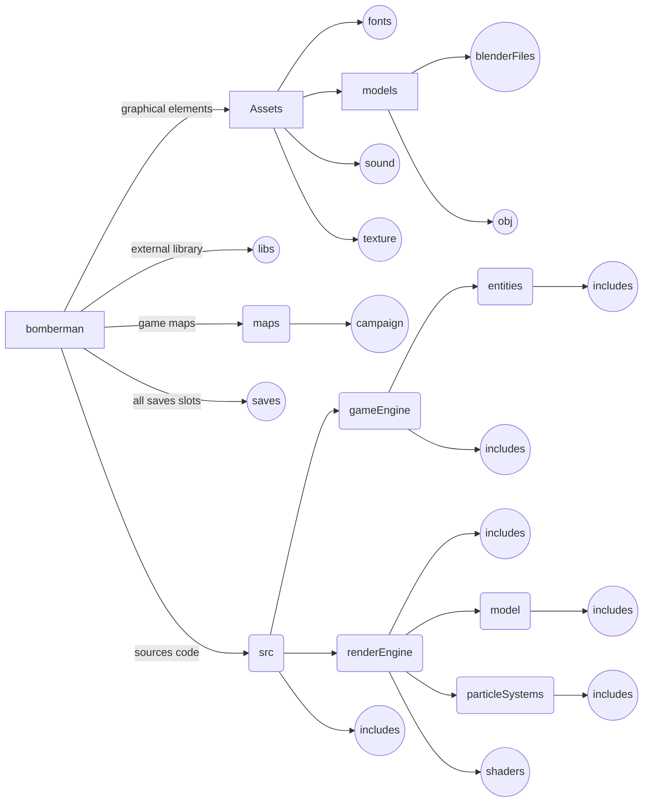
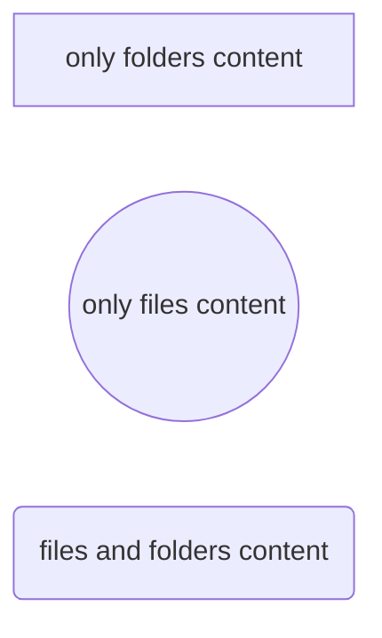

# Bomberman42

This is a 42 school project. The goal was to recreate the original game **bomberman** in 3D. The programming language needed to be **C++** with the **OpenGL** library for the graphical part. The detail in the game was an important part of the final mark.


### Autors

- [BOSSI Adrien](https://github.com/abossi)
- [FOURQUET Louis](https://github.com/4quet)
- [GABOREAU Eliott](https://github.com/EliottGaboreau)
- [Pierron Thibaut](https://github.com/thibautpierron)


### Compilation

The compilation is configured for an iOS system with a local brew.

To download the project:
```
git clone https://github.com/thibautpierron/bomberman42.git
cd ./bomberman42
```

To install dependencies:
```
make install
``` 
If the compilation don't start:
```
make
```

End finally:
```
./bomberman
```

Then... Enjoy!

## For developers

If you read that, that's mean you are interested in the project conception. To have an easier navigation throw our folders, we have make a readme in each one to explain one point of interest in correspondence with this folder.

> Welcome in the **root folder**! This is the best place to explain you the **folders hierarchy**. So... Let's go!

## Folders hierarchy


This is an overview of the folders hierarchy:



